# Architecture, Agentic Workflow, and Data / Models / Tools Inventory

**Yaad Trust Engine** · Yaadly Ltd (England and Wales, no. 17358077) · Track 02

Companion documents: `submission/PROJECT-OVERVIEW.md`, `submission/COMPLIANCE-AND-RESPONSIBLE-AI.md`, `specs/ARCHITECTURE.md` (repository tree and the decisions behind it).

---

## 1. The agentic workflow

Every box below exists in the repository. Diamonds are the points where a **named human decides** and no agent can proceed without one.

```mermaid
flowchart TD
    A["Client sends job<br/>WhatsApp text, photo or Patois voice note"] --> B["Transcription<br/>yaad-transcribe"]
    B --> C["INTAKE AGENT<br/>structured Job Card<br/>max 3 clarifying questions"]
    C --> D["PRICING AGENT<br/>fair-price band from benchmarks<br/>lookup, never a generated number"]
    D --> E{"HUMAN: client go-live<br/>profile + signed guidelines"}
    E --> F["Job opens to vetted workers<br/>yaad-match"]
    F --> G["Worker quotes<br/>vetting gate blocks probation workers<br/>on high-value, keyholding or occupied-home jobs"]
    G --> H{"HUMAN: client chooses worker<br/>Kickoff Pack approved in same transaction"}
    H --> I["Arrival Log<br/>site documented before work starts<br/>site-match gate protects the worker"]
    I --> J["Work happens<br/>materials receipts, Midnight Work-Log<br/>offline upload queue"]
    J --> K["VERIFICATION AGENT<br/>completeness, sequencing, plausibility<br/>flags gaps, never adjudicates"]
    K --> L["REPORTING AGENT<br/>plain-English status for the client"]
    L --> M{"HUMAN: worker confirms the draft<br/>send as written, or write their own"}
    M --> N["Client receives evidence<br/>photos inline in WhatsApp"]
    N --> O{"HUMAN: client approves the stage<br/>portal, WhatsApp reply, or in person"}
    O -->|approved| P["Stage released<br/>evidence ids + sha256 snapshotted<br/>worker paid within 24h"]
    O -->|disputed| Q{"HUMAN: free dispute process<br/>local surveyor by day 3<br/>human ruling by day 7"}
    Q --> P
    P --> R["Yaad Score compounds<br/>portable financial identity"]

    style E fill:#ffe8cc
    style H fill:#ffe8cc
    style M fill:#ffe8cc
    style O fill:#ffe8cc
    style Q fill:#ffe8cc
```

The vector version of this loop is `Yaad_Trust_Engine_Workflow_v5.svg`.

**The rule the diagram encodes.** `yaad/guardrails.py` holds a frozen set of human-only decisions: release funds, withhold funds, refund client, rule on dispute, adjust Yaad Score, suspend worker, approve job. An agent attempting any of them raises rather than proceeds. This is code, not a prompt instruction, and the test suite proves it.

---

## 2. System architecture

**Service boundary, decided and enforced.** Edge Functions own external callers and all AI. Next.js owns signed-in users. Invariants live in Postgres as triggers and row level security, never only in application code, so a bug in one caller cannot bypass a rule every caller must obey.

**Why the marketing site is static.** All six pages render complete with JavaScript blocked. Both corridor competitors fail that test, which costs them on Jamaican mobile data and in search.

---

## 3. Data inventory

| Category | Examples | Stored | Retention |
|---|---|---|---|
| Contact details | Name, phone, email | Supabase Postgres | Retention periods being set before the December pilot |
| Job details | Address, access contact, description, photos | Postgres, private `intake` bucket | As above |
| Worker application | Trade, parishes, years, police status, signature | Postgres | As above |
| Worker documents | Police record, proof of address, TRN, certificates, CV | Private `vetting` bucket, no browser reach | **90 days**, enforced by `yaad-vetting-purge`, verified running |
| Identity documents | Government photo ID, live selfie, face video | **Held by Persona, not by Yaadly.** Yaadly keeps the result, never the images | Persona's schedule |
| Messages | WhatsApp conversations, enquiries, voice notes | Postgres | As above |
| Consent records | Opt in value, timestamp, wording version | Postgres | Outlives the data it governs |
| Evidence | Photos, video, hashes, stage approvals | Private bucket + Postgres | Retained as the record of the job |

**Every record in the system today is synthetic.** No real client or worker data has entered it.

---

## 4. Models inventory

| Model / service | Used for | Region | Status |
|---|---|---|---|
| **MiniMax M2.7** | Intake, conversation, drafting across eight functions | China | Current, while all data is synthetic |
| **Mistral** | The same, replacing MiniMax | **EU** | Code landed 30 Aug 2026. One secret away. Switch trigger is real data, not a date |
| **NVIDIA hosted** | Document review, job photo vision | US | Live. Identity documents deliberately withheld from it |
| **Transcription chain** | Voice notes: Cloudflare, then OpenAI, Deepgram, ElevenLabs, AssemblyAI | Global / US | Live, sequential fallback |
| **OpenRouter** | Job text, `yaad-kickoff` only | US, routes onward | Live |
| **Persona** | Identity verification (not a language model) | US | Live. The only recipient of ID images |

The engine speaks the OpenAI chat completions API, so it is provider agnostic by design. All eight AI functions read one shared setting, and CI fails the build if an endpoint is hard-coded. Every model call carries its region in telemetry, so where data went is checkable rather than assumed. With no API key the engine runs in deterministic mock mode and every mocked line is labelled `(mock)`.

---

## 5. Tools inventory

| Tool | Role |
|---|---|
| **Supabase** | Postgres, 31 Edge Functions, private storage buckets, auth |
| **Next.js** | Client and worker portals at `app.yaadly.co.uk` |
| **Cloudflare** | Workers, Pages, and Zero Trust Access on the staff desk |
| **GitHub Pages** | The static marketing site and public price guide |
| **Twilio** | WhatsApp Business channel, verified sender, template management |
| **Stripe** | Card payments, principal structure, manual capture on short jobs |
| **Resend** | Transactional email |
| **Persona** | Identity and document verification |
| **pg_cron** | Deletion clocks, evidence quiet timers, job health checks |
| **ntfy.sh** | Operational alerts. Payload deliberately carries no contact details |
| **OpenTelemetry** | Spans, counters, and a bounded audit event for every money and guardrail decision. Attribute cardinality is bounded, and never carries free text, a client message or a person's name |
| **pytest** | 31 tests, including tests that prove the guardrails hold |

---

*Built from the code, not from a plan document. Rebuild the inventories whenever a new outside service is added, because a new recipient is a new row here before it is anything else.*
