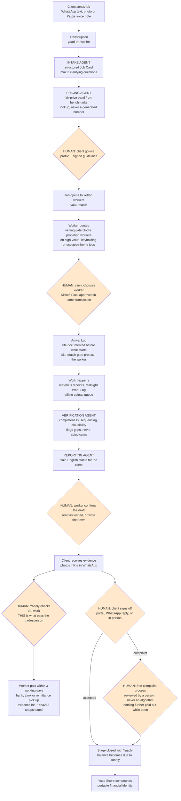
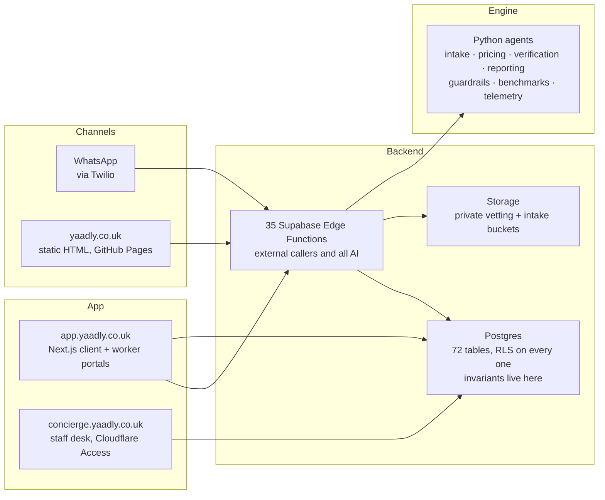

# Architecture, Agentic Workflow, and Data / Models / Tools Inventory

**Yaad Trust Engine** · Yaadly Ltd (England and Wales, no. 17358077) · Track 02

Companion documents: `submission/PROJECT-OVERVIEW.md`, `submission/COMPLIANCE-AND-RESPONSIBLE-AI.md`, `specs/Yaad_Trust_Engine_Workflow_v6.svg`.

*Figures rechecked against the live project on 7 September 2026. Where a number in an earlier version of this document has moved, the current one is here and the old one is not preserved, because an inventory is a statement of what is true now. `specs/ARCHITECTURE.md` is a target repository tree from 30 August and is deliberately not cited here: half of it is marked as not yet existing.*

---

## 1. The agentic workflow

Every box below exists in the repository. Diamonds are the points where a **named human decides** and no agent can proceed without one.

The vector version of this loop is [`specs/Yaad_Trust_Engine_Workflow_v6.svg`](../specs/Yaad_Trust_Engine_Workflow_v6.svg), redrawn on 7 September 2026 and carrying its own revision note at the foot.

**Why there was a redraw, kept on the record.** v5, drawn on 3 August, contradicted the product on three points: it showed a 48 hour auto release on accepted evidence in three places, it described funds as held with a licensed payment provider, and it stated 10 per cent retention at day 28. Nothing auto releases and a named human makes every payment call. Yaadly holds nobody's money since the principal structure was settled on 3 September 2026, and that phrase is now banned in both runtimes. Retention was cut to 5 per cent, above £500 only, on 28 August. v6 corrects all three and separates the two sign-offs, which v5 drew as a single chain: Yaadly's own check is what pays the tradesperson, and the client's sign-off is what closes the stage with Yaadly. **v5 is kept alongside v6 rather than replaced, so the change is auditable.**

**The rule the diagram encodes.** `yaad/guardrails.py` holds a frozen set of human-only decisions: release funds, withhold funds, refund client, rule on dispute, adjust Yaad Score, suspend worker, approve job. An agent attempting any of them raises rather than proceeds. This is code, not a prompt instruction, and the test suite proves it.

---

## 2. System architecture

**Service boundary, decided and enforced.** Edge Functions own external callers and all AI. Next.js owns signed-in users. Invariants live in Postgres as triggers and row level security, never only in application code, so a bug in one caller cannot bypass a rule every caller must obey.

**Why the marketing site is static.** All six pages render complete with JavaScript blocked. Both corridor competitors fail that test, which costs them on Jamaican mobile data and in search.

---

## 3. Data inventory

| Category | Examples | Stored | Retention |
|---|---|---|---|
| Contact details | Name, phone, email | Supabase Postgres | Retention periods being set before the December pilot |
| Job details | Address, access contact, description, photos | Postgres, private `intake` bucket | As above |
| Worker application | Trade, parishes, years, police status, signature | Postgres | As above |
| Worker documents | Police record, proof of address, TRN, certificates, CV | Private `vetting` bucket, no browser reach | **90 days**, enforced by `yaad-vetting-purge`, verified running |
| Identity documents | Government photo ID, live selfie, face video | **Held by Persona, not by Yaadly.** Yaadly keeps the result, never the images | Persona's schedule |
| Messages | WhatsApp conversations, enquiries, voice notes | Postgres | As above |
| Consent records | Opt in value, timestamp, wording version | Postgres | Outlives the data it governs |
| Evidence | Photos, video, hashes, stage approvals | Private bucket + Postgres | Retained as the record of the job |

**Every record in the system today is synthetic.** No real client or worker data has entered it.

---

## 4. Models inventory

| Model / service | Used for | Region | Status |
|---|---|---|---|
| **Mistral** (`mistral-small-latest`) | Intake, conversation and drafting across every text caller | **EU** | **Live since 4 September 2026.** Replaced MiniMax ahead of any real client data |
| **MiniMax** | The same, but only on a fallback call | China | **Fallback only, reinstated 5 September 2026** for a refused Mistral key or a rate limit that survives the retries. `MINIMAX_API_KEY` is unset today, so nothing routes there, and any call that ever does writes its own log line |
| **NVIDIA hosted** | Document review, job photo vision | US | Live. Identity documents deliberately withheld from it |
| **Transcription chain** | Voice notes: Cloudflare Workers AI Whisper, then OpenAI, Deepgram, ElevenLabs Scribe, AssemblyAI | Global / US | Live, sequential fallback |
| **OpenRouter** | Nothing | US, routes onward | **Removed 5 September 2026** with `yaad-kickoff`'s own provider picker. Listed so the row is not silently forgotten |
| **Persona** | Identity verification (not a language model) | US | Live. The only recipient of ID images |

The engine speaks the OpenAI chat completions API, so it is provider agnostic by design. Every text caller reads one shared setting, `supabase/functions/_shared/textmodel.ts`, and CI fails the build if any function hard-codes an endpoint. That is what made the China to EU move a configuration change rather than a rewrite. Every model call carries its region in telemetry, so where data went is checkable rather than assumed. With no API key the engine runs in deterministic mock mode and every mocked line is labelled `(mock)`.

Two things still leave the European Union and are named rather than glossed: photographs go to NVIDIA in the United States, and voice notes go to the transcription chain above. `docs/privacy.html` says so on the public page.

---

## 5. Tools inventory

| Tool | Role |
|---|---|
| **Supabase** | Postgres in eu-west-3 (Paris), 35 Edge Functions, private storage buckets, auth |
| **Next.js** | Client and worker portals at `app.yaadly.co.uk` |
| **Cloudflare** | Workers, Pages, and Zero Trust Access on the staff desk |
| **GitHub Pages** | The static marketing site and public price guide |
| **Twilio** | WhatsApp Business channel, verified sender, template management |
| **Stripe** | Card payments, principal structure, manual capture on short jobs |
| **Resend** | Transactional email |
| **Persona** | Identity and document verification |
| **pg_cron** | Deletion clocks, evidence quiet timers, job health checks |
| **ntfy.sh** | Operational alerts. Payload deliberately carries no contact details |
| **OpenTelemetry** | Spans, counters, and a bounded audit event for every money and guardrail decision. Attribute cardinality is bounded, and never carries free text, a client message or a person's name. **Stated honestly: no exporter endpoint is configured, so the tracer is inert today and the spans go nowhere.** Where a fact has had to be proved, it has been proved from the function logs instead |
| **pytest** | 52 tests, including tests that prove the guardrails hold. A second Deno suite asserts the same banned phrases in the live runtime, so a pattern loosened on one side fails CI on the other |

---

*Built from the code, not from a plan document. Rebuild the inventories whenever a new outside service is added, because a new recipient is a new row here before it is anything else.*
